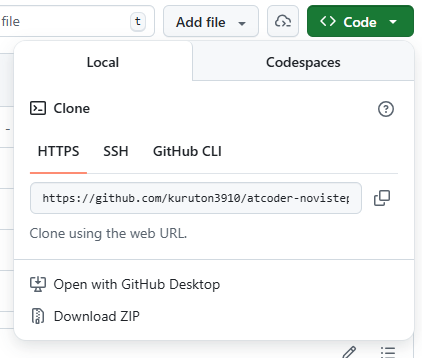
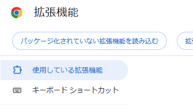

# AtCoder NoviSteps Auto Sync

AtCoder での AC 状況を、[AtCoder NoviSteps](https://atcoder-novisteps.vercel.app/) へ自動的に同期するための Chrome 拡張機能（非公式）です。

---

## 開発の背景

[AtCoder NoviSteps](https://atcoder-novisteps.vercel.app/) は、けんちょん（@drken）さんを始めとする有志の方々や、スポンサーの方々の尽力によって運営されている、競プロ学習者にとって最高の「道標」です。人力で丁寧に選定された解法分けやレベル分けは、新人コーダーが次の一歩（入緑）を踏み出すために欠かせない存在となっています。

この素晴らしいロードマップをよりスムーズに活用したい、そして「精進そのものに全神経を集中させたい」という想いから、自動同期ツールを作成しました。

---

## 特徴

- **ワンタップ同期:** ページを開くと右下にボタンが現れ、ワンクリックで [AtCoder Problems](https://kenkoooo.com/atcoder/) API から最新の AC 状況を取得し、自動で NoviSteps の進捗に反映します。
- **低負荷設計:** サーバーへの敬意を忘れず、リクエスト間に適切な待機時間を設けています。

---

## 動作確認環境

- Google Chrome（最新版推奨）

---

## 使い方（デベロッパーモードでの導入）

1. このリポジトリを ZIP でダウンロードし、解凍します。

   

2. `content.js` の冒頭にある `const USER_ID = "あなたのID";` を、**自分の AtCoder ID に書き換えて保存してください（この手順を忘れると正常に動作しません）。**
3. Chrome で `chrome://extensions/` を開きます。
4. 「デベロッパーモード」を ON にし、「パッケージ化されていない拡張機能を読み込む」からフォルダを選択してください。

   

> ⚠️ **注意:** `USER_ID` を書き換えずに使用した場合、同期は正常に機能しません。必ず手順2を実行してください。

---

## 必要な権限について

本拡張機能は以下の権限を使用します。

- `kenkoooo.com` へのアクセス（AC状況の取得）
- `atcoder-novisteps.vercel.app` へのアクセス（進捗の書き込み）

これら以外のサイトやデータへはアクセスしません。

---

## 注意事項・既知の制限

- 同期は AtCoder Problems への提出データの反映状況に依存します。AtCoder Problems 側の更新が遅れている場合、NoviSteps への反映も遅れることがあります。
- 同期済み問題の「取り消し」には対応していません。
- 問題数が多い場合、初回の同期に時間がかかることがあります。
- [AtCoder Problems API](https://kenkoooo.com/atcoder/) の利用規約・利用制限をご確認のうえ、常識の範囲内でご利用ください。

---

## 謝辞とリスペクト

本ツールは、以下の素晴らしいサービスと、その開発者・運営者様に心からの敬意を表して作成されました。

- **[AtCoder NoviSteps](https://atcoder-novisteps.vercel.app/)** 様（発起人：@drken1215 様、および開発メンバーの皆様）
- **[AtCoder Problems](https://kenkoooo.com/atcoder/)** 様（@kenkoooo 様）
- **[AtCoder](https://atcoder.jp/)** 様（AtCoder株式会社 様）

---

## 免責事項

- 本ツールは個人が作成した**完全非公式**のツールです。
- 本ツールに関するお問い合わせを、NoviSteps 運営チームや AtCoder 株式会社様へ行わないでください。
- ご利用は自己責任でお願いします。

---

## License

[MIT License](./LICENSE)
